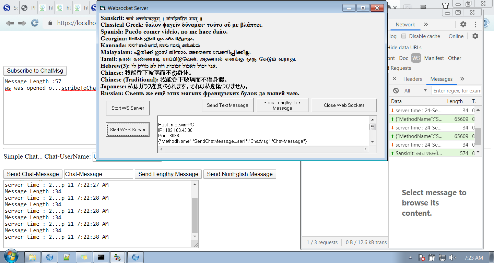

# vb6-websocket-server-ssl
vb6 websocket server with ssl.
Secure webSocket in Pure VB6 no external Libraries or ActiveX.
Now wss://localhost:8088 is possible.
Now Lengthy(char length more than 65536) messages possible.

Thanks goes to :
  . Vladimir Vissoultchev(wqweto)
  . Olaf Schmidt
  . xxdoc123
and many others.
https://github.com/wqweto/VbAsyncSocket

https://www.vbforums.com/showthread....ushServer-Demo

https://github.com/bloatless/php-websocket

https://www.cnblogs.com/xiii/p/5165303.html

In order to create a self-signed ssl certificate you need open-ssl. In my case I have done it in my cloud server and downloaded.
Follow the instructions given here :

https://www.freecodecamp.org/news/ho...-7af615770eec/

after install the certificate. open rootCa.crt -> Install Certificate - > Next -> Place all certificates in the following store -> Browse
-> Trusted Root Certification Authorities - > OK -> Next - > Finish - > Install/Approve

Notes:

I have combined and ported codes from here and there, and given the references, detailed code explanations can be found there.

